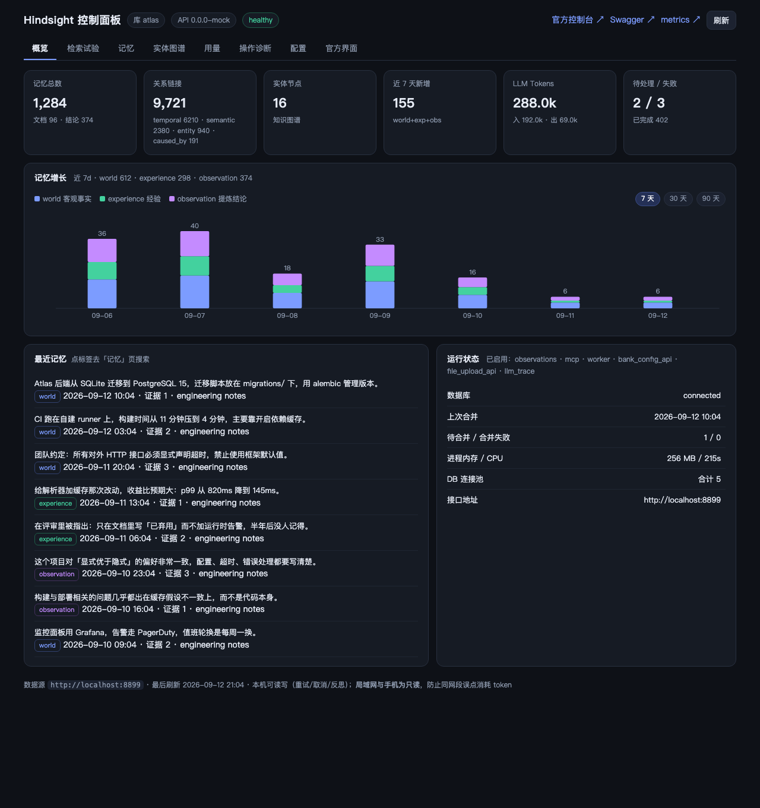
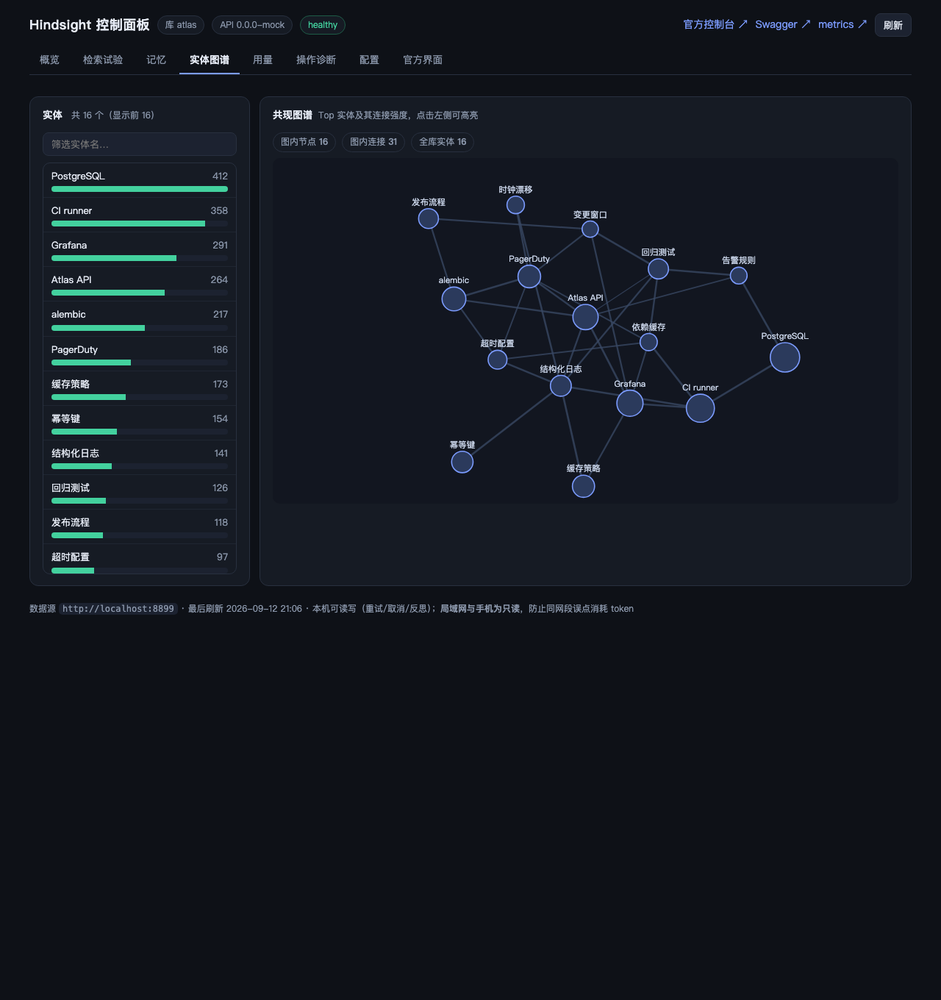
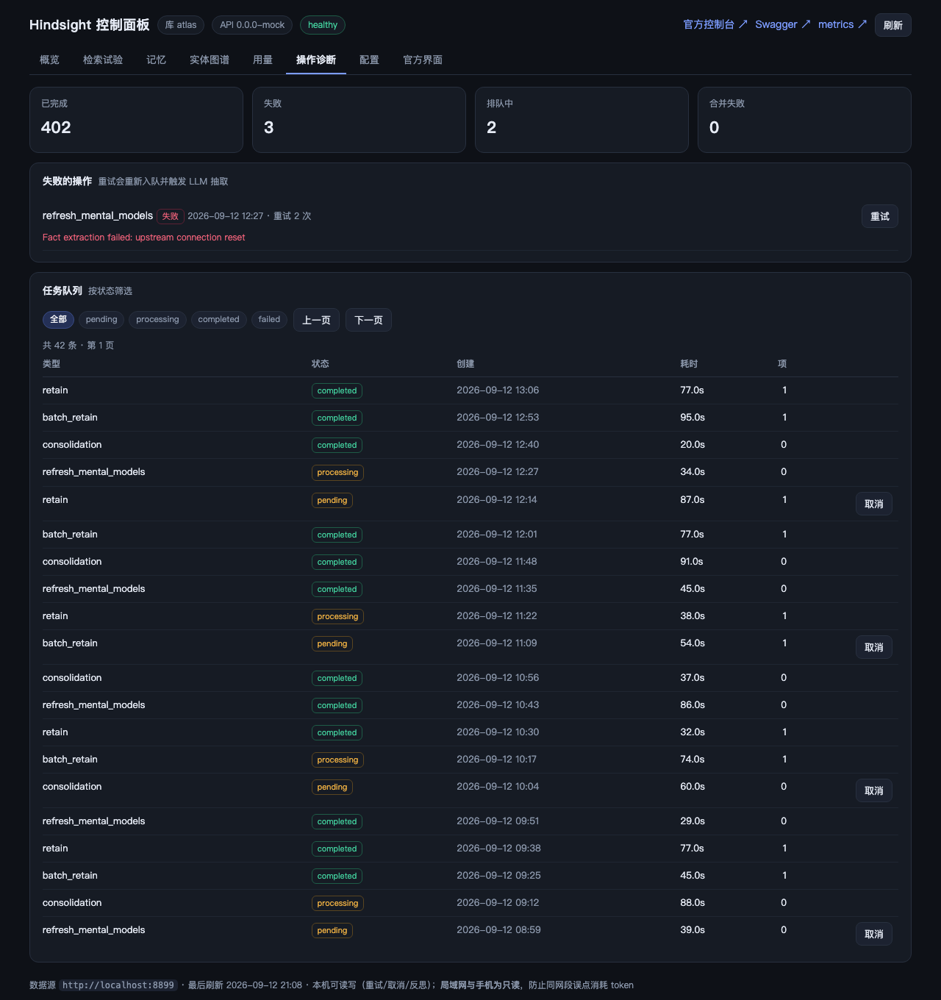

# Hindsight Dashboard

A **single-file, zero-dependency** web dashboard for [Hindsight](https://github.com/vectorize-io/hindsight) — the agent memory system from Vectorize.

No `pip install`, no build step, no Node. One Python file using only the standard library, talking to Hindsight's REST API.



## Why this exists

If you self-host Hindsight, you get:

- **Swagger UI** at `/docs` — good for poking individual endpoints, not for looking at your memory as a whole.
- **Prometheus metrics** at `/metrics` — raw counters, not much use at a glance.
- **The official Control Plane** (a separate Next.js app, default port `9999`) — full-featured, but general-purpose, and it needs a Node toolchain to install.

This project fills the gap between them: a lightweight aggregation + operations view that runs anywhere Python does, and that can optionally **embed the official Control Plane in one of its tabs** — so you get your own at-a-glance overview without giving up the official tooling.

## Features

| Tab | What it gives you |
|---|---|
| **Overview** | Memory / link / entity / document counts, stacked growth chart by fact type (`world` / `experience` / `observation`), 7 / 30 / 90-day ranges, recent memories, runtime state (DB, consolidation, RSS, pool) |
| **Recall** | Run `recall` and see the **per-strategy scores** (`final` / `semantic` / `reranker`), plus `reflect` for a synthesized answer over your memories |
| **Memories** | Full-text search, fact-type filter, pagination |
| **Entities** | Searchable entity list with mention counts + a **dependency-free SVG force-directed co-occurrence graph** (click a node to highlight its neighbours) |
| **Usage** | Per-request LLM trace table (operation, model, latency, tokens, status), daily token bars, cumulative calls per stage, process stats |
| **Operations** | Async task queue with status filters, **one-click retry of failed operations**, cancel pending ones |
| **Config** | Bank profile, mission, directives, retention/consolidation parameters (read-only) |
| **Official UI** | The official Control Plane embedded via iframe |





## Quick start

Requirements: **Python 3.9+**. Nothing else.

```bash
curl -O https://raw.githubusercontent.com/GerateGuo/hindsight-dashboard/main/hindsight-dashboard.py
python3 hindsight-dashboard.py --api http://localhost:8888 --bank my-bank
# open http://127.0.0.1:8990
```

Running Hindsight somewhere else? Point `--api` at it:

```bash
python3 hindsight-dashboard.py --api http://192.168.1.10:8988 --bank my-bank --port 8990
```

If you use [Hermes Agent](https://github.com/NousResearch/hermes-agent), the defaults are picked up automatically from `~/.hermes/hindsight/config.json` (`api_url` + `bank_id`), so plain `python3 hindsight-dashboard.py` is usually enough.

### Options

```
--port PORT                  listen port (default 8990)
--host HOST                  bind address (default 127.0.0.1)
--api API                    Hindsight API base URL
--bank BANK                  memory bank id
--cp CP                      official Control Plane URL, for the embedded tab + links
--access-key KEY             remote access key (or use the key file)
--allow-remote-write         let non-local clients trigger retry / reflect / cancel
```

| Env var | Default | Purpose |
|---|---|---|
| `HS_DASH_CONFIG_JSON` | `~/.hermes/hindsight/config.json` | optional config used to infer `api_url` / `bank_id` |
| `HS_DASH_KEY_FILE` | `~/.hermes/hindsight/access-key.txt` | file holding the remote access key |

## Security model

The panel can read every memory you have, and some buttons cost LLM tokens — so it is locked down by default:

- **Loopback only by default.** It binds `127.0.0.1`. Nothing on your network can reach it.
- **Access key for remote clients.** With `--host 0.0.0.0` you should set a key. Local (`127.0.0.1`) requests stay password-free, so desktop use is unchanged; remote clients must present `?k=<key>` once (which plants an HttpOnly `30-day` cookie and then scrubs the key from the URL bar) or send the cookie. Requests without a key get a login page (no data) and `/api/*` returns `401`.
- **Remote writes are read-only by default.** `POST /api/retry`, `/api/reflect` and cancels are rejected with `403` unless they come from loopback, unless you pass `--allow-remote-write`.

> **Also lock down Hindsight itself.** Hindsight's REST API has **no authentication** — if port `8888`/`8988` is reachable, anyone on the network can read or wipe every memory. Bind it to loopback (`HINDSIGHT_API_HOST=127.0.0.1`) and let the dashboard/Control Plane proxy to it locally.

## How it works

The dashboard is a thin server-side proxy plus one static page. It calls these Hindsight endpoints and stitches them into a single `/api/summary` payload:

```
/health · /version · /metrics
/v1/default/banks
/v1/default/banks/{bank}/stats
/v1/default/banks/{bank}/stats/memories-timeseries?period=7d|30d|90d
/v1/default/banks/{bank}/memories/list · memories/{id} · memories/recall
/v1/default/banks/{bank}/reflect
/v1/default/banks/{bank}/entities · entities/graph
/v1/default/banks/{bank}/operations · operations/{id}/retry
/v1/default/banks/{bank}/llm-requests · llm-requests/stats
/v1/default/banks/{bank}/profile · config · directives
```

Own routes: `/api/summary`, `/api/memories`, `/api/entities`, `/api/graph`, `/api/ops`, `/api/llm-requests`, `/api/config`, `/api/cancel` (GET) and `/api/recall`, `/api/reflect`, `/api/retry` (POST). Deep links: `#overview`, `#recall`, `#memories`, `#graph`, `#usage`, `#ops`, `#config`, `#official`. You can also run a query straight from the URL:

```
http://localhost:8990/?q=deployment+timeouts&mode=recall&budget=low#recall
```

## Development

A mock API with synthetic data is included, so you can develop or screenshot the UI without a real Hindsight instance:

```bash
python3 dev/mock_hindsight_api.py --port 8899
python3 hindsight-dashboard.py --api http://localhost:8899 --bank atlas --port 8995
```

All screenshots in this README were produced against that mock.

## Gotchas worth knowing

- **Proxy environment variables.** If `HTTP_PROXY` is set (Clash/VPN setups), localhost requests get routed through the proxy and come back `502`. The dashboard builds its opener with an empty `ProxyHandler` to bypass this; remember the same when testing with `curl --noproxy '*'`.
- **`period` values.** `memories-timeseries` supports `7d` / `30d` / `90d`; an unsupported value like `14d` silently falls back to `7d`.
- **launchd caches plists.** On macOS, editing a LaunchAgent plist and running `launchctl kickstart -k` does **not** reload environment variables — use `launchctl bootout` + `launchctl bootstrap`.
- **Iframe embedding works** because the official Control Plane sends no `X-Frame-Options` / `frame-ancestors` — if that changes upstream, the "Official UI" tab will need a link instead.
- **Plain HTTP.** The key travels in cleartext over your LAN. If that matters, bind to a VPN interface (e.g. Tailscale) or put it behind TLS.

## 中文说明

自托管的 Hindsight 只有 Swagger（`/docs`）和 Prometheus（`/metrics`），官方 Control Plane 是另一个独立的 Next.js 前端。这个单文件面板是两者的轻量补充：**纯 Python 标准库、零依赖**，把 Hindsight 的 REST 接口聚合成一个可视界面（概览、检索打分、实体图谱、LLM 用量、失败任务一键重试、配置查看），并可以把官方界面 iframe 内嵌进来。

```bash
python3 hindsight-dashboard.py --api http://localhost:8888 --bank my-bank
# 打开 http://127.0.0.1:8990
```

安全默认值：只监听 `127.0.0.1`；用 `--host 0.0.0.0` 暴露到局域网时建议配访问密钥（本机免密），远程写操作默认被拒（`--allow-remote-write` 可放开）。**另外记得把 Hindsight 本体也绑到回环地址**——它的 REST 接口没有认证，端口一旦可达，同网段任何人都能读取或清空全部记忆。

## License

MIT — see [LICENSE](LICENSE).
